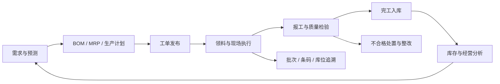

# polaris
北极星-针对制造业的ERP开源项目，物料、寻源、采购、质检、仓储、供应商管理、财务对账、流程审批等
# Polaris MES/WMS 一体化制造运营平台


Polaris 是一套面向制造企业的开源业务基线，围绕 **ERP 经营管理、MES 生产执行、WMS 仓储作业、QMS 质量管理和流程审批**，打通从需求、计划、生产、收发料到库存、质量和经营分析的业务链路。

项目提供 PC 管理端、移动 H5/PDA 端、微信小程序 `web-view` 壳工程，以及可独立部署的流程中心，适合用于制造业数字化项目的原型验证、二次开发、实施交付和技术研究。

> 当前版本：`0.1.0`  
> 项目状态：可启动、可联调、持续完善中的业务基线。正式生产部署前，请完成安全加固、数据迁移、性能压测、备份恢复和现场验收。

## 核心能力

| 领域 | 能力范围 |
| --- | --- |
| 制造执行 MES | BOM、版本、生产计划、MRP、齐套分析、工单、派工、报工、工时、良品/不良品、完工入库、缺料、叫料和 ASN |
| 仓储管理 WMS | 仓库/库区/库位/物料/批次主数据，收料、上架、领料、退料、成品入库、销售出库、调拨、移库、盘点和库存锁定 |
| 条码与追溯 | 条码规则、生成、打印、补打、作废、扫码解析、批次追溯和库存事务流水 |
| 质量管理 QMS | 来料/过程/成品检验计划、检验批、结果判定、不合格处置、隔离/返工/报废/退货、纠正预防措施和整改关闭 |
| ERP 业务底座 | 销售、采购、财务和主数据记录，状态流转、审计留痕和制造/库存经营指标看板 |
| 流程中心 BPM | Flowable 流程定义、表单、审批、人工作业、业务动作、条件/并行/包容网关、事件审计和任务指标 |
| 平台能力 | 多租户、用户/角色/菜单/按钮/API/字段权限、通知中心、操作审计、流量/存储配额和发版管理 |
| 设计与扩展 | 快速报表、低代码页面、大屏配置，以及采购申请 AI 辅助生成能力 |

## 业务闭环



仓储事务遵循：

```text
到货/领料申请 → 扫描单据 → 扫描物料/批次 → 数量确认 → 库位确认 → 提交事务 → 更新库存 → 留存审计
```

## 系统架构

```text
polaris/
├── main-service/       # Java 服务端、REST API、权限、事务、审计、数据库脚本
├── main-web/           # Vue 3 + Vite PC 管理端
├── main-app/           # Vue 3 + Vite 移动 H5/PDA 端及微信小程序 web-view 壳
├── bpm/
│   ├── bpm-service/    # Flowable 流程服务，默认端口 8090
│   └── bpm-web/        # 流程设计与管理端，默认端口 8091
├── docs/               # 业务、技术、SOP 和架构文档
├── scripts/            # 文档和交付资料生成脚本
└── docker-compose.yml  # MySQL、API、Web 和流程中心开发/演示环境
```

主要技术栈：

| 层次 | 技术 |
| --- | --- |
| 后端 | Java 17、Spring Boot 3.3.4、Spring JDBC、MyBatis-Plus 3.5.7、Flowable 7.1.0 |
| 数据库 | MySQL 8；测试支持 H2 |
| 前端 | Vue 3、Vue Router、Vite 5、pnpm |
| 部署 | Docker、Docker Compose、Nginx |
| 认证与治理 | 租户绑定 Bearer Token、权限模型、幂等控制、审计日志、健康检查 |

## 快速开始

### 环境要求

- Docker Desktop 或 Docker Engine + Compose
- JDK 17+
- Maven 3.9+
- Node.js 18+ 和 pnpm

### 方式一：分别启动开发服务

先启动 MySQL：

```bash
docker compose up -d mysql
```

启动服务端：

```bash
cd main-service
mvn spring-boot:run
```

启动 PC 管理端：

```bash
cd main-web
pnpm install
pnpm dev
```

启动移动 H5/PDA 端：

```bash
cd main-app
pnpm install
pnpm dev -- --host
```

启动流程中心（可选）：

```bash
cd bpm/bpm-service
mvn spring-boot:run

cd ../bpm-web
pnpm install
pnpm dev
```

### 方式二：启动完整演示栈

```bash
POLARIS_TOKEN_SECRET='请替换为至少 32 位随机字符串' docker compose up -d --build
```

启动后访问：

| 服务 | 地址 |
| --- | --- |
| PC 管理端 | <http://localhost:8081> |
| 主服务 API | <http://localhost:8080> |
| 主服务健康检查 | <http://localhost:8080/api/health/readiness> |
| 流程中心 | <http://localhost:8091> |
| 流程 API 健康检查 | <http://localhost:8090/actuator/health> |
| MySQL | `localhost:3306` |

### 本地演示账号

初始化数据会提供以下示例账号：

| 租户 | 账号 | 密码 | 用途 |
| --- | --- | --- | --- |
| `demo` | `admin` | `admin123` | 客户租户管理员 |
| `polaris-admin` | `platform-admin` | `admin123` | 平台总管理员 |

登录时需要提交 `tenantCode`、`username` 和 `password`。以上凭据仅用于本地演示，首次登录后请立即修改；生产环境不得使用仓库中的默认数据库密码和账号。

## 多租户与平台治理

- 租户由 `sys_tenant` 管理，登录成功后令牌绑定用户和租户身份。
- 业务、权限、设计和发版数据按 `tenant_id` 隔离，服务端查询和写入统一执行租户条件过滤。
- 支持企业自主注册、试用期、用户配额、通知中心、操作审计和数据库就绪探针。
- 平台总管理员可以维护客户租户、功能授权、计费账户、积分流水、流量配额、存储配额、客服工单和培训活动。
- 发版管理支持生成 `DATA` 数据包或 `DEPLOYMENT` 部署包，并通过清单指纹、SHA-256 校验和发布门禁降低环境漂移风险。

生产环境至少应设置：

```bash
POLARIS_TOKEN_SECRET='长度不少于 32 位的随机密钥'
```

同时建议通过云平台 Secret 管理数据库密码、域名证书、第三方服务凭据和其他敏感配置。

## API 示例

健康检查：

```bash
curl http://localhost:8080/api/health/readiness
```

登录：

```bash
curl -X POST http://localhost:8080/api/auth/login \
  -H 'Content-Type: application/json' \
  -d '{"tenantCode":"demo","username":"admin","password":"admin123"}'
```

核心接口分组：

- `/api/auth`：租户目录、登录、当前用户和当前租户
- `/api/manufacturing`：BOM、工单、报工、MRP、缺料、叫料和 ASN
- `/api/warehouse`：仓储主数据、库存、单据、条码、盘点和批次追溯
- `/api/quality`：检验计划、检验批、检验结果和不合格闭环
- `/api/erp`：销售、采购、财务和主数据记录
- `/api/design`：报表、低代码页面和大屏配置
- `/api/dashboard`：制造、库存、销售、采购和质量指标
- `/api/releases`：版本台账、清单校验、发布和交付包下载

## 文档

- [业务需求与验收说明](docs/business-requirements.md)
- [技术设计基线](docs/technical-design.md)
- [主服务架构说明](docs/main-service-architecture.md)
- [流程服务架构说明](docs/bpm-service-architecture.md)
- [MES/WMS 技术设计文档](docs/Polaris-MES-WMS-Technical-Design.docx)
- [MES/WMS 操作 SOP](docs/Polaris-MES-WMS-SOP.docx)
- [采购申请审批 AI 功能说明](docs/FS-采购申请审批-AI生成功能-v0.1.0.docx)
- [数据库初始化脚本](main-service/src/main/resources/db/schema.sql)

## 测试与构建

后端测试：

```bash
cd main-service
mvn test

cd ../bpm/bpm-service
mvn test
```

前端构建：

```bash
cd main-web
pnpm build

cd ../main-app
pnpm build

cd ../bpm/bpm-web
pnpm build
```

## 当前范围与生产化计划

本项目提供端到端可启动和可联调的核心业务基线，适合作为实施项目的起点。以下能力仍应结合企业现场进行设计、开发和验收：

- 完整 MRP 算法、复杂产能约束和高级排产
- 财务总账、税务、成本核算和供应商协同
- ERP/WMS/财务/设备等外部系统接口
- 设备联网、OEE、消息队列、离线同步和打印机协议
- SSO、生产级密码策略、细粒度安全加固和渗透测试
- 数据迁移、压测、容灾、备份恢复和生产运维体系

## 开源前检查清单

发布到 GitHub 前建议确认：

1. 在根目录补充合适的 `LICENSE` 文件；当前仓库尚未声明开源许可证。
2. 将数据库密码、Token Secret、域名和第三方凭据全部改为环境变量或 Secret，避免提交真实敏感信息。
3. 检查仓库中的 PPTX、图片、字体、文档和行业资料是否具备公开分发权限；必要时使用 Git LFS 或将大文件迁移到 Release/独立资料仓库。
4. 清理构建产物、缓存、临时目录和本地 IDE 配置，并完善 `.gitignore`。
5. 在干净环境重新执行完整启动、测试和构建流程。

## 参与贡献

欢迎通过 Issue 反馈问题、提出功能建议或提交 Pull Request。提交代码时请尽量同步：

- 业务场景和数据边界说明
- API 或数据库结构变更说明
- 前端页面和交互变更截图
- 对应的测试或验证步骤

## 许可证

当前仓库尚未提供 `LICENSE` 文件。请在公开发布前根据代码、文档、图片、字体和行业资料的实际权利情况补充许可证及第三方声明。
